<div align="center">

# ¡Habla, Camarón!

### Simulador educativo de conducción manual ambientado en Quito, Ecuador

[](https://unity.com/)
[](https://learn.microsoft.com/dotnet/csharp/)
[](https://docs.unity3d.com/Packages/com.unity.render-pipelines.universal@latest)
[](#pruebas-automatizadas)
[](https://github.com/Adrizzx/HablaCamaron/releases/latest)

**[Descargar el juego (Windows)](https://github.com/Adrizzx/HablaCamaron/releases/latest)** · [Arquitectura](#arquitectura) · [IA: A* + FSM](#inteligencia-artificial-a--fsm) · [Pruebas](#pruebas-automatizadas)

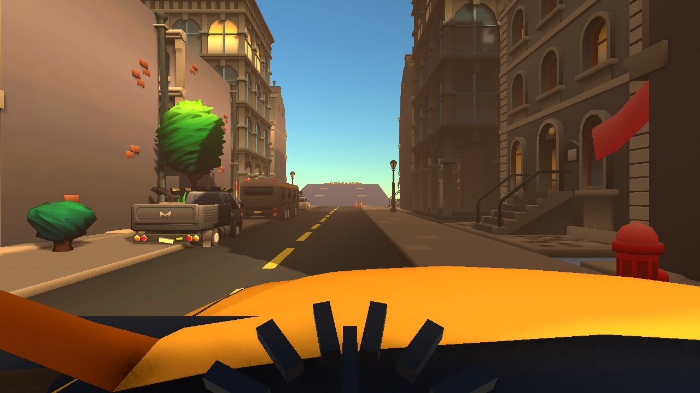

</div>

---

## Sobre el proyecto

**¡Habla, Camarón!** es un videojuego serio en primera persona que enseña a manejar un auto **con caja manual** en las calles de Quito. El jugador es "Camarón", un joven que aprende a conducir el Aveo de su papá con **Don Pancho** como instructor, para llegar a tiempo al concierto con **Mishel**.

El foco del proyecto es la **simulación realista del embrague** (punto de fricción, calado del motor, arranque en pendiente) y un **tránsito urbano con IA** donde cada auto NPC planifica su ruta y toma decisiones en tiempo real.

> Proyecto desarrollado en la asignatura **Desarrollo de Videojuegos** de la carrera de Ingeniería de Software, **Universidad de las Fuerzas Armadas ESPE** (2026).

## Características principales

| Área | Qué hace |
|---|---|
| **Física del vehículo** | Motor simulado por RPM, embrague con punto de fricción y calado, caja 5 + R protegida, freno de mano, dirección sensible a la velocidad. Datos por vehículo en `ScriptableObject` (Aveo y BT-50). |
| **IA de tránsito** | Navegación con **A\*** sobre un grafo dirigido de calles y comportamiento con una **máquina de estados finitos** (crucero, seguir, frenar, ceder, doble fila). Personalidades: taxista, buseta, particular. |
| **Mundo** | Zonas de Quito (Quitumbe/Guamaní, Av. Simón Bolívar, corredor Centro → La Carolina), semáforos con ciclo real, señalética ecuatoriana generada por código. |
| **Misiones y evaluación** | 8 niveles progresivos con jueces de infracciones (semáforo en rojo, carril, direccionales, pasos cebra) y puntaje de 0 a 100 en 6 criterios. |
| **Instructor en vivo** | Don Pancho reacciona a los eventos del auto (calado, rechinido de caja, buen arranque) y un tutor guía el ritual de arranque paso a paso. |
| **UI 100 % por código** | 13 pantallas uGUI construidas desde C# con un sistema de tema centralizado (`UITheme` + `UIFactory`). |
| **Audio procedural** | Sonido del motor sintetizado según RPM y efectos de cambio, calado y freno de mano. |

## Capturas

<table>
  <tr>
    <td>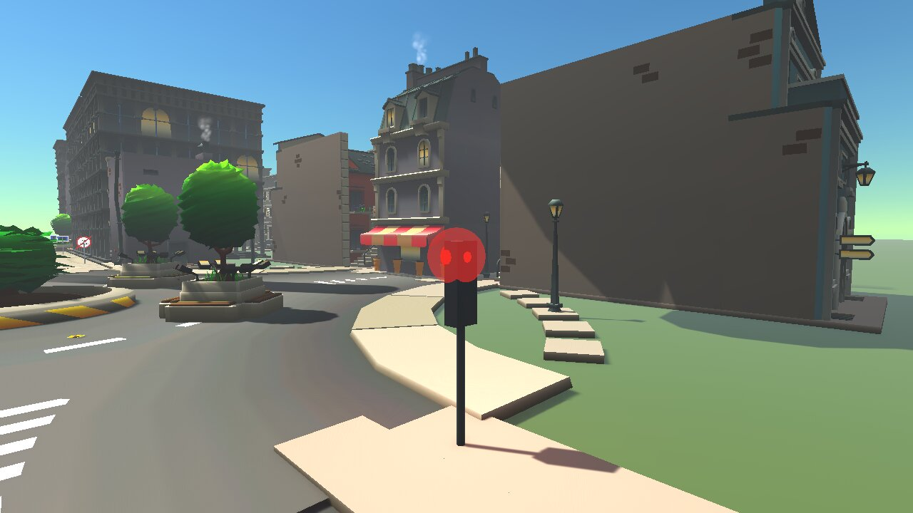</td>
    <td>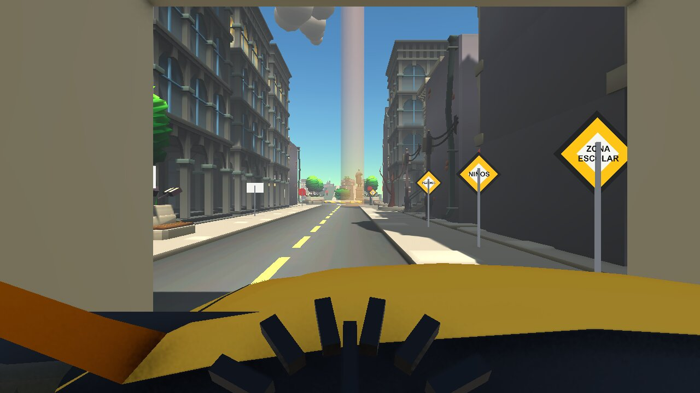</td>
  </tr>
  <tr>
    <td align="center"><sub>Tránsito con semáforos y NPCs</sub></td>
    <td align="center"><sub>Conducción en primera persona</sub></td>
  </tr>
  <tr>
    <td>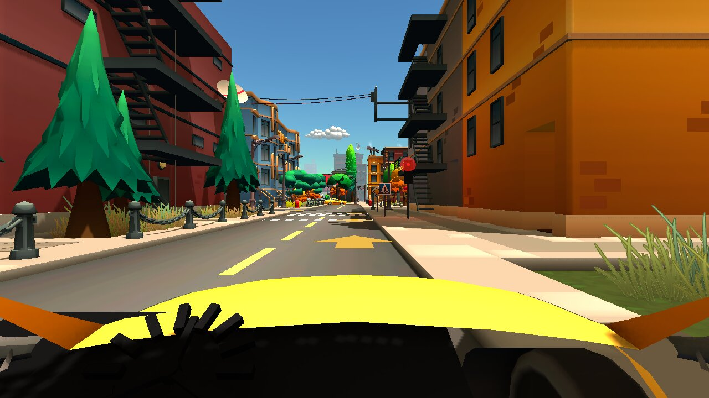</td>
    <td>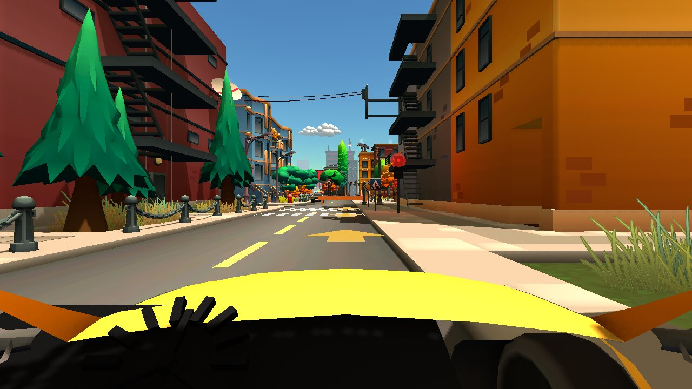</td>
  </tr>
  <tr>
    <td align="center"><sub>Nivel 4 · El redondel</sub></td>
    <td align="center"><sub>Nivel 6 · Hora pico</sub></td>
  </tr>
  <tr>
    <td>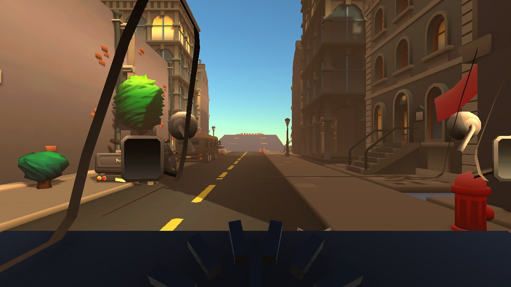</td>
    <td>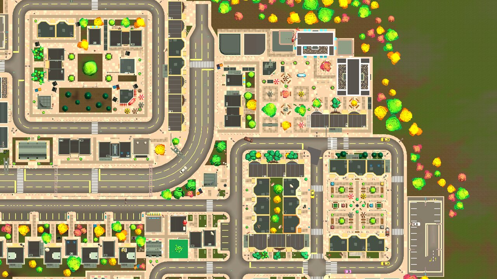</td>
  </tr>
  <tr>
    <td align="center"><sub>Cabina de la BT-50 (desbloqueable)</sub></td>
    <td align="center"><sub>Vista aérea de la ciudad</sub></td>
  </tr>
</table>

<div align="center">
  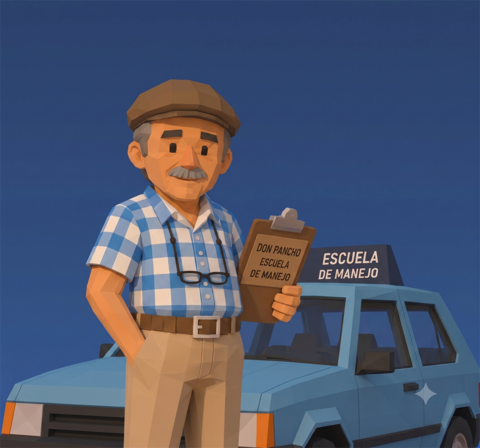
  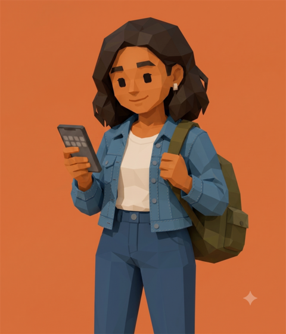
  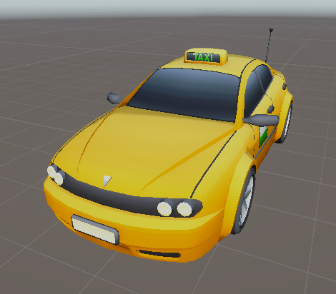
  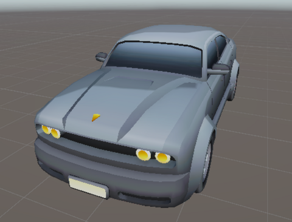
  <br><sub>Personajes y vehículos: Don Pancho, Mishel, Chevrolet Aveo y Mazda BT-50</sub>
</div>

## Niveles

| # | Misión | Habilidad que se evalúa |
|---|---|---|
| 1 | Sacar el Aveo | Embrague, reversa y primera sin calar |
| 2 | La vuelta a la manzana | Marchas 1ª a 3ª, semáforos y PARE |
| 3 | La cuesta de Guamaní | Arranque en pendiente con freno de mano |
| 4 | El redondel | Ceder el paso y usar direccionales |
| 5 | La Simón de noche | Luces, velocidad alta, 4ª y 5ª marcha |
| 6 | Hora pico | Tránsito denso y conducción defensiva |
| 7 | ¡Habla, Camarón! | Examen final con tiempo; dos finales posibles |
| 8 | Quito entero | Recorrido libre por la ciudad completa |

## Arquitectura

El código está organizado por **namespaces y assemblies** independientes, con datos separados de la lógica y comunicación por **eventos C#** (sin dependencias cruzadas por *polling*).

```
Assets/Scripts
├── Core/       GameManager, GameData (guardado), SceneLoader, Bootstrap, audio
├── Vehicle/    VehicleController, VehicleSpec (SO), VehicleInput, DriverCamera, EngineAudio
├── AI/         AStarPlanner, MinHeap, NpcBrain (FSM), NpcDriver, TrafficManager, DriverProfile
├── World/      RoadGraph / RoadGraphData, TrafficLightCycle, señalética
├── Missions/   MissionCatalog, MissionRunner, MissionScoring y jueces de infracciones
├── UI/         UITheme, UIFactory y las 13 pantallas del juego
└── Editor/     Generadores de escenas y ciudad (herramientas del menú "Habla Camarón")
Assets/Tests
├── EditMode/   Lógica pura: A*, FSM, puntajes, progresión, fórmulas
└── PlayMode/   Física: embrague, calado, frenos, sensores de NPC
```

**Decisiones de diseño**

- **Datos en ScriptableObjects:** fichas de vehículo, perfiles de conductor NPC y misiones. El código es genérico; los datos marcan la diferencia.
- **Escenas generadas por código:** las herramientas de editor construyen la ciudad, las calles y los semáforos de forma reproducible.
- **Eventos en lugar de referencias directas:** el auto emite `OnStalled`, `OnGearGrind`, etc., y el HUD, Don Pancho y el puntaje se suscriben.

## Inteligencia artificial: A* + FSM

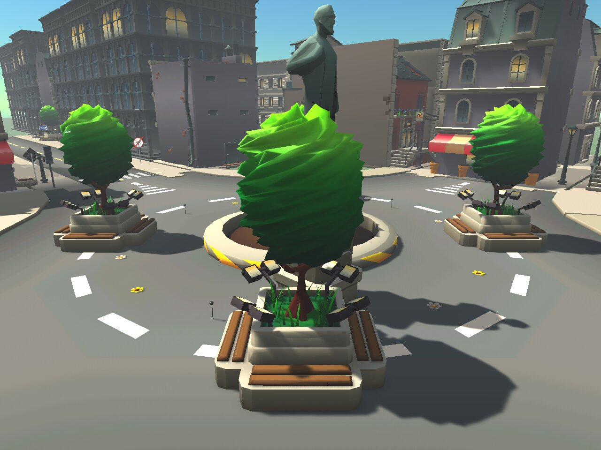

**Navegación con A\***

- La ciudad se modela como un **grafo dirigido** (`RoadGraphData`): nodos por carril y aristas con costo igual a la distancia real en metros, respetando el sentido de las vías.
- `AStarPlanner` usa una **heurística euclidiana admisible** y una cola de prioridad propia (`MinHeap`) para obtener la ruta óptima explorando menos nodos que Dijkstra o BFS.
- Los NPCs re-planifican si la ruta se bloquea (doble fila, choque adelante).

**Toma de decisiones con FSM**

- `NpcBrain` implementa los estados **Crucero, Seguir, Frenar, Ceder, Chocado y Doble fila**, con transiciones basadas en sensores (raycasts y *overlap*).
- Un solo cerebro genérico + perfiles de personalidad (`DriverProfile`) generan conductas distintas sin duplicar código.
- Overlay de depuración en vivo con la tecla **F9**.

 Documento técnico completo: [`docs/PRESENTACION_IA.md`](docs/PRESENTACION_IA.md)

<br clear="right">

## Pruebas automatizadas

El proyecto sigue una regla estricta: **toda lógica nueva entra con sus pruebas en el mismo commit**.

- **~400 pruebas EditMode** (NUnit) para lógica pura: A*, transiciones de la FSM, puntajes, progresión.
- **~44 pruebas PlayMode** para comportamiento con física: embrague, calado, frenos y sensores.
- Ciclo de verificación por tarea: compilación en *batch mode* sin errores → ambas suites en verde → playtest manual → commit.

```bash
Unity.exe -batchmode -projectPath <ruta> -runTests -testPlatform EditMode -testResults Logs/tests-editmode.xml
Unity.exe -batchmode -projectPath <ruta> -runTests -testPlatform PlayMode -testResults Logs/tests-playmode.xml
```

## Controles

| Tecla | Acción | Tecla | Acción |
|---|---|---|---|
| `Shift` | Embrague (mantener) | `Espacio` | Freno de mano |
| `W` / `S` | Acelerar / frenar | `Q` / `E` | Direccionales |
| `A` / `D` | Volante | `L` | Luces |
| `1`-`5`, `N`, `R` | Caja de cambios | `B` | Bocina |
| `F` | Encender / apagar motor | `C` | Cambiar cámara |
| `H` | Ayuda de controles | `F9` | Depuración de IA |

> **Ritual de arranque:** `Shift` → `F` → `1` → un poco de acelerador → soltar `Shift` despacio. Soltarlo de golpe cala el motor, y esa es justamente la lección.

## Cómo jugarlo

1. Descarga el `.zip` de la [última versión](https://github.com/Adrizzx/HablaCamaron/releases/latest).
2. Descomprime y ejecuta `HablaCamaron.exe` (Windows 10/11, 64 bits).

## Sobre este repositorio

Este repositorio publica el **código fuente, las pruebas y la documentación técnica** del juego. Los modelos 3D de la ciudad provienen del paquete comercial *Toon City* (Unity Asset Store), cuya licencia no permite redistribuir sus archivos fuente, por eso no se incluyen aquí. El desarrollo completo se lleva en un repositorio privado del equipo.

## Equipo

| Integrante | Rol |
|---|---|
| **Marco Adrian Padilla Triviño** ([@Adrizzx](https://github.com/Adrizzx)) | Desarrollo (autor principal del código) |
| Juan Mateo Iza Barrionuevo | Desarrollo |
| Eduardo García | Desarrollo |

<div align="center">
<sub>Universidad de las Fuerzas Armadas ESPE · Ingeniería de Software · 2026</sub>
</div>
