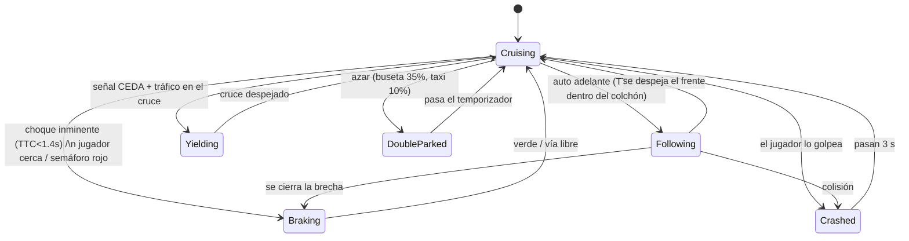

# ¡Habla, Camarón! — Implementación de IA (A\* + FSM)

> **Documento técnico para las diapositivas — Unidad 3 (20 pts)**
> Equipo ESPE: Mateo Iza · Eduardo García · Marco Padilla
> Videojuego: simulador educativo de conducción manual en Quito (Unity 6000.3.16f1, URP, C#)
> Módulos de IA: `HablaCamaron.AI` y `HablaCamaron.World`

Este documento resume **solo lo técnico e importante** para armar la exposición.
Está ordenado según los **6 criterios de la rúbrica** para que cada diapositiva
mapee directo a un puntaje.

---

## 0. Resumen ejecutivo (portada / diapositiva 1)

- **Problema de IA que resolvemos:** un mundo de tránsito quiteño creíble donde
  **NPCs (autos)** naveguen calles reales y **tomen decisiones** de manejo
  (frenar, seguir, ceder, respetar semáforos) sin chocar al jugador que aprende.
- **Dos algoritmos combinados:**
  1. **A\* (A-estrella)** → **navegación**: qué ruta seguir por las calles.
  2. **FSM (Máquina de Estados Finitos)** → **toma de decisiones**: cómo comportarse
     instante a instante (crucero, seguir, frenar, ceder, chocado, doble fila).
- **Diseño clave:** un solo cerebro genérico + **datos de personalidad**
  (Taxista, Buseta, Particular) → comportamientos distintos sin duplicar código.
- **Estado:** funcional, verificado en batch, **235/235 tests EditMode + 11/11 PlayMode**
  para la IA y el mundo, con overlay de depuración en vivo (tecla **F9**).

---

## 1. Selección y pertinencia del algoritmo (Criterio 1 — 4 pts)

### ¿Por qué A\* para navegación?
- El tránsito necesita que cada NPC vaya **de un punto A a un punto B por las
  calles reales**, respetando el **sentido de las vías** (calles de una sola mano).
- Modelamos la ciudad como un **grafo dirigido de calles** (`RoadGraphData`):
  - **Nodos** = puntos por carril (posición 3D + si tiene semáforo + si tiene señal).
  - **Aristas dirigidas** = tramos transitables; **costo = distancia real en metros**.
- A\* es el estándar de la industria para *pathfinding* en grafos: encuentra la
  **ruta de menor costo** y, con una **heurística admisible**, garantiza la
  **ruta óptima** explorando muchos menos nodos que Dijkstra o BFS.

### ¿Por qué FSM para el comportamiento?
- Manejar es un conjunto **acotado y legible** de situaciones: ir en crucero,
  seguir al de adelante, frenar por semáforo/obstáculo, ceder el paso, estar
  chocado, parar en doble fila. Una **FSM** modela esto con claridad, es
  **determinista, depurable y testeable**, y basta para tránsito urbano
  (no necesitamos aprendizaje ni árboles de comportamiento pesados).

### Pertinencia (encaja con la rúbrica)
> "adecuado para una necesidad real: **navegación, toma de decisiones,
> comportamiento de enemigos, generación de rutas**" → cubrimos **navegación**
> (A\*) **+ toma de decisiones / comportamiento de NPC** (FSM), la combinación
> canónica de IA de agentes en videojuegos.

---

## 2. Explicación del funcionamiento (Criterio 2 — 4 pts)

### 2.1 A\* — entradas, proceso, salida
**Entradas:** el grafo `RoadGraphData`, nodo `start`, nodo `goal`.
**Salida:** lista ordenada de nodos (la ruta) **o `null`** si no hay camino
respetando los sentidos.

**Fórmula del costo:** para cada nodo se evalúa
$$ f(n) = g(n) + h(n) $$
- $g(n)$ = costo real acumulado desde el inicio (suma de distancias de las aristas).
- $h(n)$ = **heurística euclidiana** = distancia en línea recta al destino.

**¿Por qué la heurística es admisible?** La línea recta **nunca sobreestima** la
distancia real por calles (siempre es ≤). Una heurística admisible garantiza que
A\* devuelva la **ruta óptima**.

**Proceso (bucle principal):**
1. Se mantiene un conjunto `open` (frontera) con el `start`.
2. Se toma el nodo de `open` con **menor $f$**.
3. Si es el `goal` → se **reconstruye** la ruta hacia atrás (`cameFrom`) y termina.
4. Si no, se pasa a `closed` y se **relajan sus vecinos**: si se llega a un vecino
   por un camino más barato, se actualiza $g$, $f$ y su predecesor.
5. Se repite hasta llegar al goal o vaciar `open` (→ `null`, sin camino).

**Condiciones de salida:**
- Éxito: se expande el `goal` → ruta reconstruida.
- Fallo: `open` vacío → no hay ruta respetando el sentido de las vías (`null`).

### 2.2 FSM — entradas, proceso, salida
**El cerebro es una función PURA:** `NpcBrain.Decide(sensores, perfil, obedece)`.

**Entradas (lo que el NPC "ve", `NpcSensors`):**
| Sensor | Significado |
|---|---|
| `AheadDistance` | metros al vehículo de adelante |
| `AheadClosingSpeed` | m/s a los que nos acercamos a él |
| `RedLightAhead` + `LightDistance` | semáforo en rojo/amarillo en la ruta y su distancia |
| `YieldAhead` | señal de "ceda" con tráfico moviéndose en el cruce |
| `PlayerNear` | el jugador está dentro de la burbuja defensiva |

**Proceso (prioridades, de mayor a menor):**
1. **Choque inminente** → `Braking` (velocidad 0). Se decide por **TTC**
   (*Time-To-Collision* = distancia / velocidad de cierre); si `TTC < 1.4 s` o
   está más cerca que `MinGap·0.6`, frenada de emergencia.
2. **Jugador cerca** (`PlayerNear`) → `Braking` a 0. **Regla de oro:** al que
   aprende **jamás lo embiste el tráfico** (se detiene y le pita).
3. **Semáforo en rojo** dentro de la distancia de frenado (si el perfil lo
   respeta) → `Braking` proporcional (lejos rueda, cerca se detiene).
4. **Vehículo adelante** dentro del colchón (por metros o por TTC de confort
   `< 3 s`) → `Following`, ajustando velocidad para no cerrar la brecha.
5. **Ceda el paso** con tráfico en el cruce → `Yielding` (velocidad 0).
6. **Vía libre** → `Cruising` a la velocidad de crucero del perfil.

**Salida (`NpcDecision`):** el **estado** elegido + la **velocidad objetivo** (m/s).
`NpcDriver` solo **ejecuta** esa decisión (mueve el auto, gira ruedas, pita).

### 2.3 Cómo se conectan A\* y la FSM
```
A* (navegación)  →  ruta de nodos  →  NpcDriver la sigue nodo a nodo
                                        │
                                        ├─ Sense(): raycasts + semáforos → NpcSensors
                                        ▼
FSM (NpcBrain.Decide)  →  estado + velocidad objetivo  →  movimiento cinemático
```
Cuando el NPC llega al final de la ruta (o queda bloqueado mucho tiempo),
**vuelve a pedir una ruta nueva** a A\* hacia otro nodo → deambular urbano infinito.

---

## 3. Aplicación al videojuego (Criterio 3 — 4 pts)

**Situación concreta:** el jugador ("Camarón") aprende a manejar el Aveo del papá
por **tres zonas de Quito** (Zona Sur, Av. Simón Bolívar nocturna, Corredor del
Examen). En cada misión hay **tráfico vivo** de NPCs generado por el
`TrafficManager`.

### Las tres personalidades quiteñas (mismos algoritmos, distintos datos)
Todo sale de un `DriverProfile` (ScriptableObject). El comportamiento **emerge de
los números**, no de código distinto:

| Perfil | Crucero | MinGap | Obediencia al rojo | Doble fila | Personalidad |
|---|---|---|---|---|---|
| **Taxista** | 12 m/s (apurado) | 3 m (se pega) | **0.65** (se lanza al amarillo/rojo) | 10% | agresivo |
| **Buseta** | 8 m/s (pesada) | 6 m | 0.90 | **35%** ("¡sube, sube!") | lenta y estorbosa |
| **Particular** | 9 m/s | 5 m | **1.0** (respeta) | 0% | conservador |

Mezcla en el tráfico: **55% particulares, 25% taxistas, 20% busetas**.

### Cómo mejora jugabilidad, dificultad, realismo y experiencia
- **Realismo:** los autos siguen calles reales, respetan sentidos, frenan en los
  semáforos, se siguen entre sí y ceden el paso → una ciudad **creíble**, no autos
  en riel.
- **Dificultad graduada:** cada misión ajusta la **densidad de tráfico**
  (`MaxNpcs`) — de calles casi vacías (tutorial) a **hora pico** en el examen.
- **Jugabilidad justa:** la **burbuja defensiva** (el NPC se detiene y pita al
  jugador en vez de embestirlo) hace que el aprendiz nunca sea castigado
  injustamente por la IA — clave en un juego **educativo**.
- **Ambiente quiteño:** taxistas que se lanzan al rojo y busetas que paran en
  doble fila reproducen el tránsito real de Quito → identidad y humor del GDD.
- **Anti-atascos:** si un NPC lleva 6 s bloqueado **replanifica ruta** (A\* otra
  vez); a los 14 s, si el jugador no mira, se recicla → el tránsito nunca se
  congela.

---

## 4. Representación técnica (Criterio 4 — 3 pts)

### 4.1 Diagrama de la FSM del conductor NPC


### 4.2 Pseudocódigo de A\*
```
función A*(grafo, inicio, meta):
    open   ← { inicio }                 // frontera
    gScore[inicio] ← 0
    fScore[inicio] ← h(inicio, meta)    // h = distancia euclidiana
    mientras open no esté vacío:
        actual ← nodo de open con menor fScore
        si actual == meta:
            devolver reconstruir(cameFrom, actual)   // ¡ruta óptima!
        mover actual de open a closed
        para cada vecino de actual (según sentido de la vía):
            si vecino en closed: continuar
            tentativo ← gScore[actual] + costo(actual, vecino)  // costo = distancia
            si tentativo < gScore[vecino]:
                cameFrom[vecino] ← actual
                gScore[vecino]   ← tentativo
                fScore[vecino]   ← tentativo + h(vecino, meta)
                agregar vecino a open
    devolver null      // no hay camino respetando los sentidos
```

### 4.3 Mapa de nodos (el grafo de calles)
- `RoadGraphData`: **nodos por carril** + **aristas dirigidas** (flechas = sentido).
- Costo de arista = `Vector3.Distance(from, to)` (metros).
- Utilidades: `Neighbors`, `NearestNode` (spawn/re-ruta), `IsReachable` (BFS que
  valida que cada mapa generado sea navegable), `Validate` (detecta nodos sin
  salida = "callejón para la IA").
- **Depuración visual (gizmos):** nodos cian, semáforos rojos, señales amarillas,
  **flechas de sentido**; al seleccionar un NPC su ruta A\* se pinta en **magenta**.

### 4.4 Demostración funcional en vivo (para la exposición)
- **Tecla F9:** overlay con el **estado FSM** de cada NPC en tiempo real.
- **Escena → seleccionar NPC:** su ruta A\* aparece en magenta.
- **Gizmos del grafo:** nodos, aristas y sentidos visibles en el editor.

### 4.5 Fragmentos de código reales (para capturas)
- A\*: [Assets/Scripts/AI/AStarPlanner.cs](../Assets/Scripts/AI/AStarPlanner.cs)
- FSM (cerebro puro): [Assets/Scripts/AI/NpcBrain.cs](../Assets/Scripts/AI/NpcBrain.cs)
- Personalidades: [Assets/Scripts/AI/DriverProfile.cs](../Assets/Scripts/AI/DriverProfile.cs)
- Ejecutor + sensores: [Assets/Scripts/AI/NpcDriver.cs](../Assets/Scripts/AI/NpcDriver.cs)
- Grafo de calles: [Assets/Scripts/World/RoadGraph.cs](../Assets/Scripts/World/RoadGraph.cs)
- Semáforos (ciclo puro): [Assets/Scripts/World/TrafficLights.cs](../Assets/Scripts/World/TrafficLights.cs)
- Orquestador de tráfico: [Assets/Scripts/AI/TrafficManager.cs](../Assets/Scripts/AI/TrafficManager.cs)

---

## 5. Análisis de resultados y limitaciones (Criterio 5 — 3 pts)

### Beneficios / resultados obtenidos
- **Rutas óptimas garantizadas** por la heurística admisible; A\* explora poco
  gracias a $h$ (más eficiente que Dijkstra/BFS puro).
- **Comportamiento creíble y variado** con un solo cerebro + 3 perfiles de datos.
- **Totalmente testeado:** A\* y la FSM son **funciones puras y estáticas** →
  se prueban en EditMode caso por caso (ruta óptima vs alternativa cara,
  contravía, isla/sin-camino, anillo antihorario; tabla de verdad de la FSM +
  personalidades). Suite verde: **235/235 EditMode + 11/11 PlayMode**.
- **Rendimiento:** NPCs **cinemáticos** (`Rigidbody` kinematic con `MovePosition`)
  → 12+ autos fluidos; spawn/despawn alrededor del jugador (uno por frame).

### Posibles errores y casos donde podría fallar
- **A\* con cola de prioridad (heap):** elegir el mínimo $f$ es ahora
  $O(\log n)$ por paso (antes una lista lineal $O(n)$). Implementado en
  `MinHeap` — escala a los mapas grandes de la ciudad.
- **`EdgeCost` indexado:** el costo de arista sale en $O(1)$ de una adyacencia
  cacheada (`RoadGraphData.NeighborEdges`), no de recorrer todas las aristas.
- **Sensado por raycasts** en curvas: se mitiga lanzando los "bigotes" hacia el
  **siguiente nodo de la ruta** (no la trompa) y con **disciplina de carril**
  (ignora lo lejano y desplazado = carril contrario), pero geometrías raras
  pueden confundirlo.
- **Bloqueos:** resueltos con un **desempate determinista** (dos NPCs parados →
  el de menor InstanceID reanuda) y **adelantamiento** de obstáculos estáticos
  con carril libre; la red de seguridad (replanificar a los 6 s, reciclar a los
  14 s) queda como respaldo.
- **Sin aprendizaje / sin adaptación dinámica de dificultad:** la dificultad se
  fija por misión (densidad), no cambia según el desempeño del jugador.

### Mejoras propuestas
- ~~Cola de prioridad (binary heap) e índice de costos~~ — **implementado**.
- ~~Cambio de carril / rebasar~~ — **implementado** (estado `Overtaking`
  conservador: solo rodea obstáculos estáticos con el carril libre).
- Semáforos "inteligentes" reactivos al flujo y **adaptación de dificultad**
  según cómo maneja el jugador.
- Migrar a **Behavior Trees** o **utility AI** si el comportamiento crece.
- Perfiles como **ScriptableObjects editables** por diseñadores sin tocar código.

---

## 6. Guion de exposición grupal (Criterio 6 — 2 pts)

Reparto sugerido (participación equilibrada) y términos técnicos a dominar:

| Bloque | Contenido | Términos clave a usar bien |
|---|---|---|
| **Intro + problema** | qué juego es y qué IA resuelve | agente, NPC, navegación vs decisión |
| **A\*** | grafo, $f=g+h$, heurística admisible, óptimo | nodo, arista dirigida, costo, frontera, heurística |
| **FSM** | estados, prioridades, sensores, TTC | estado, transición, sensor, Time-To-Collision |
| **Demo** | F9 overlay, ruta magenta, gizmos del grafo | determinista, función pura |
| **Análisis** | complejidad, límites, mejoras | $O(n)$, cola de prioridad, escalabilidad |

**Cierre (frase de impacto):** *"Un solo cerebro, tres personalidades quiteñas:
A\* pone la ruta, la máquina de estados pone el carácter — y al que está
aprendiendo, nadie lo embiste."*

---

## Anexo — Datos rápidos para las diapositivas

- **Motor:** Unity 6000.3.16f1, URP, C# (API de Input clásica).
- **Namespaces IA:** `HablaCamaron.AI` (planner, brain, driver, profile, manager),
  `HablaCamaron.World` (grafo, semáforos, señales).
- **Constantes de la FSM:** `CriticalTtc = 1.4 s`, `ComfortTtc = 3 s`.
- **Ciclo semafórico:** Verde 8 s → Amarillo 2 s → Rojo (+ colchón "todo en rojo"
  1 s), dos grupos alternados, **determinista** (estado = función del tiempo).
- **Mezcla de tráfico:** 55% particular / 25% taxi / 20% buseta.
- **Verificación:** compilación batch limpia; **235/235 EditMode + 11/11 PlayMode**;
  overlay F9 + gizmos como demostración funcional ante el docente.
